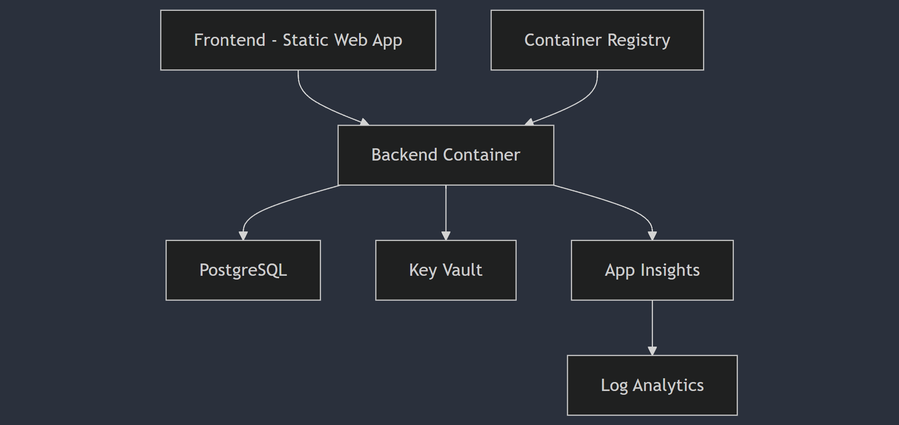

# IE Bank Design Documentation

## System Requirements

### Backend Container Requirements
1. **Python Flask API**
   - Must be containerized using Docker
   - Must connect to PostgreSQL database
   - Must expose REST endpoints for account management
   - Must handle environment-specific configurations
   - **Tests**: api_tests.py - test_database_connection, test_endpoints
   - **User Story**: [IEBANK-1] Containerize Backend API

2. **Database Integration**
   - Must use Azure PostgreSQL Flexible Server
   - Must handle secure credential management
   - Must support automatic migrations
   - Must implement connection pooling
   - **Tests**: database_tests.py - test_migrations, test_connections
   - **User Story**: [IEBANK-2] Setup Database Infrastructure

3. **Environment Configuration**
   - Must support multiple environments (Dev/UAT)
   - Must use environment variables
   - Must handle secrets securely
   - **Tests**: config_tests.py - test_env_variables
   - **User Story**: [IEBANK-3] Environment Configuration Setup

### Frontend Requirements
1. **Static Web App**
   - Must be deployed to Azure Static Web Apps
   - Must integrate with backend API
   - Must handle authentication
   - **Tests**: frontend_tests.py - test_api_integration
   - **User Story**: [IEBANK-4] Static Web App Implementation

### Security Requirements
1. **Authentication & Authorization**
   - Must implement secure user authentication
   - Must use Azure Key Vault for secrets
   - Must enforce HTTPS
   - **Tests**: security_tests.py - test_auth, test_https
   - **User Story**: [IEBANK-5] Security Implementation

### Monitoring Requirements
1. **Application Monitoring**
   - Must use Application Insights
   - Must track key metrics
   - Must set up alerts
   - **Tests**: monitoring_tests.py - test_telemetry
   - **User Story**: [IEBANK-6] Monitoring Setup

## Technical Architecture


## Environment Setup
1. Development Environment
   ```yaml
   Resource Group: BCSAI2024-DEVOPS-STUDENTS-A-DEV
   Access Level: Contributor
   Services:
     - App Service (Container)
     - PostgreSQL
     - Static Web App
     - Key Vault
   ```

2. UAT Environment
   ```yaml
   Resource Group: BCSAI2024-DEVOPS-STUDENTS-A-UAT
   Access Level: Reader
   Services:
     - App Service (Container)
     - PostgreSQL
     - Static Web App
     - Key Vault
   ```

## Implementation Plan
1. Infrastructure Setup [IEBANK-7]
   - Deploy base infrastructure
   - Configure networking
   - Setup monitoring

2. Container Implementation [IEBANK-8]
   - Create Dockerfile
   - Setup CI/CD
   - Configure container registry

3. Frontend Deployment [IEBANK-9]
   - Setup static web app
   - Configure CI/CD
   - Implement API integration

4. Security Implementation [IEBANK-10]
   - Configure Key Vault
   - Setup authentication
   - Implement HTTPS

## Testing Strategy
1. Unit Tests
   - API endpoints
   - Database operations
   - Authentication flows

2. Integration Tests
   - API-Database integration
   - Frontend-Backend integration
   - Container deployment

3. End-to-End Tests
   - Complete user flows
   - Performance testing
   - Security testing
