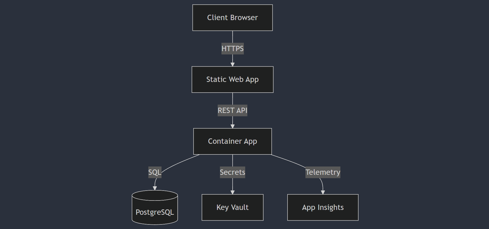

# IE Bank Software Design Documentation

## 1. Release Strategy
### Environment Design


### DevOps Checklist Implementation
1. **Source Control**
   - GitHub repository
   - Branch protection rules
   - PR reviews required

2. **Build Automation**
   - Automated builds on push
   - Testing integration
   - Code quality checks

3. **Release Management**
   - Environment-based deployments
   - Automated rollback
   - Feature flags

### DevSecOps Implementation
1. **Security Scanning**
   - CodeQL analysis
   - Dependency scanning
   - SAST implementation

2. **Secret Management**
   - Azure Key Vault integration
   - Rotation policies
   - Access controls

## 2. Use Case and Sequential Models

### Use Case: Create Bank Account


### Use Case: Process Transaction


## 3. Entity Relationship Diagram


## 4. Data Flow Diagram


## 5. 12 Factor App Implementation

1. **Codebase**
   - Single repository
   - Git-based version control
   - Branch strategy defined

2. **Dependencies**
   - Requirements.txt for Python
   - Package.json for Node.js
   - Docker containers

3. **Config**
   - Environment variables
   - Azure App Configuration
   - Key Vault integration

4. **Backing Services**
   - PostgreSQL database
   - Key Vault
   - Application Insights

5. **Build, Release, Run**
   - GitHub Actions CI/CD
   - Environment-based releases
   - Container deployments

6. **Processes**
   - Stateless application
   - Session management
   - Cache implementation

7. **Port Binding**
   - Container port mapping
   - Load balancer configuration
   - Health checks

8. **Concurrency**
   - Horizontal scaling
   - Process management
   - Resource allocation

9. **Disposability**
   - Quick startup/shutdown
   - Graceful termination
   - Health probes

10. **Dev/Prod Parity**
    - Environment consistency
    - Infrastructure as Code
    - Configuration management

11. **Logs**
    - Centralized logging
    - Application Insights
    - Log Analytics

12. **Admin Processes**
    - Management scripts
    - Database migrations
    - Maintenance tasks

## 6. User Stories

### Infrastructure Setup
```yaml
Title: Setup Container Infrastructure
Description: As a DevOps engineer, I need to setup container infrastructure
Acceptance Criteria:
- Container registry deployed
- App Service configured
- Network rules established
```

### Security Implementation
```yaml
Title: Implement Secret Management
Description: As a security engineer, I need to implement secure secret management
Acceptance Criteria:
- Key Vault configured
- Access policies defined
- Secret rotation implemented
```

### Monitoring Setup
```yaml
Title: Configure Application Monitoring
Description: As an SRE, I need to setup comprehensive monitoring
Acceptance Criteria:
- App Insights configured
- Alerts defined
- Dashboards created
```
